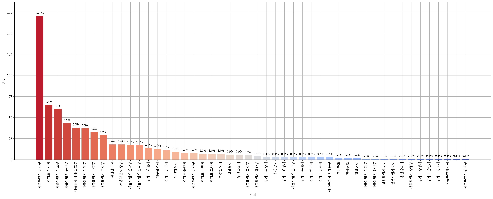
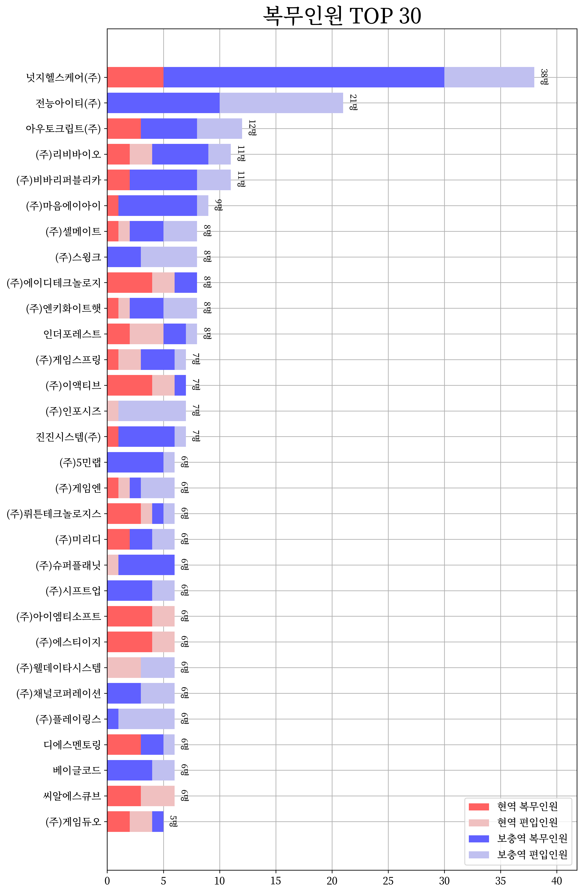
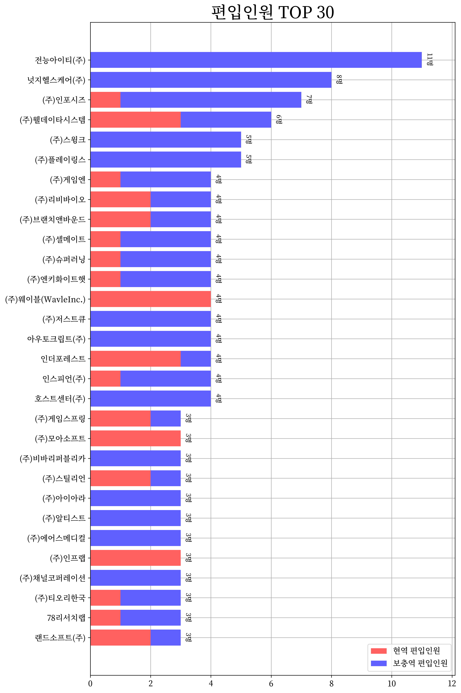
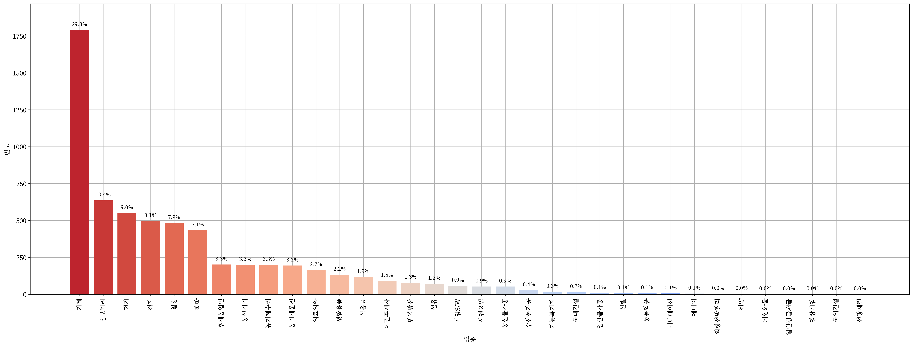
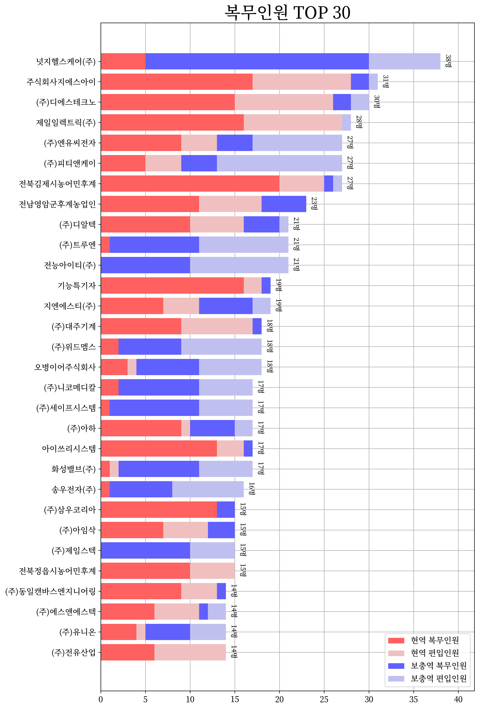
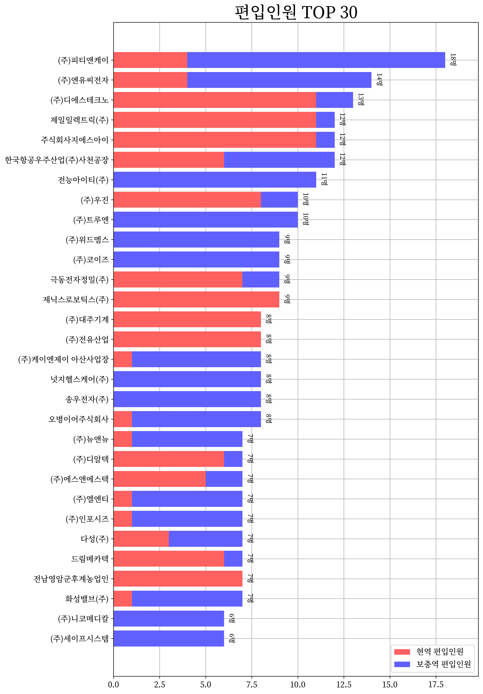

 <h1> 🧑‍💻 산업기능요원을 위한 데이터 적재 및 시각화 🧑‍💻 </h1> 

  
   
  
   
  

 

> [**「병역법 제2조제17항」**](https://www.law.go.kr/%EB%B2%95%EB%A0%B9/%EB%B3%91%EC%97%AD%EB%B2%95/%EC%A0%9C2%EC%A1%B0) “산업기능요원”이란 산업을 육성하고 지원하기 위하여 제36조에 따라 산업기능요원(産業技能要員)으로 편입되어 해당 분야에 복무하는 사람을 말한다.

> [**「병역법 제3조제1항」**](https://www.law.go.kr/%EB%B2%95%EB%A0%B9/%EB%B3%91%EC%97%AD%EB%B2%95/%EC%A0%9C3%EC%A1%B0) 대한민국 국민인 남성은 헌법과 이 법에서 정하는 바에 따라 병역의무를 성실히 수행하여야 한다.

  <h2> 💻 IT 산업기능요원 💻 </h2>

  

    
    
    
    
     
    <a href="prop/IT/README.md"> 📝 표로 보기 📝 </a>
  

  <h2> 💡 전체 산업기능요원 💡 </h2>

  

    
    
    
    
    
  

---

+ [awesome-alternative-military-service](https://github.com/sesang06/awesome-alternative-military-service)
+ [Alternative-Military-Service-Guide](https://github.com/Curo-Dev/Alternative-Military-Service-Guide)
+ [Alternative-Military-Service-List](https://github.com/hansolbangul/Alternative-Military-Service-List)

---

> [!NOTE]
> See also [awesome-jmy](https://github.com/Zerohertz/awesome-jmy)
