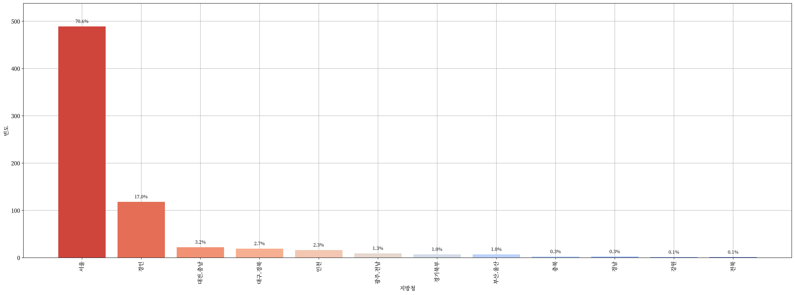
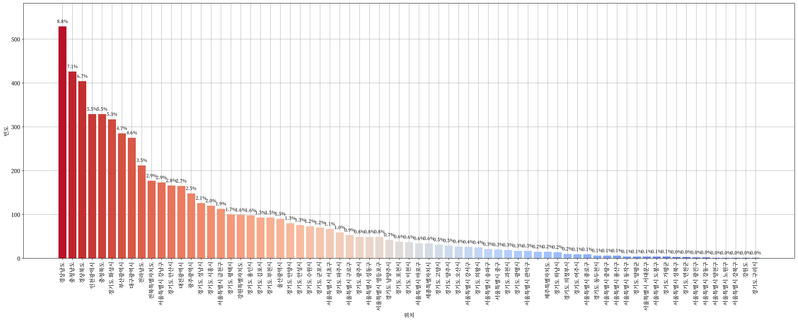
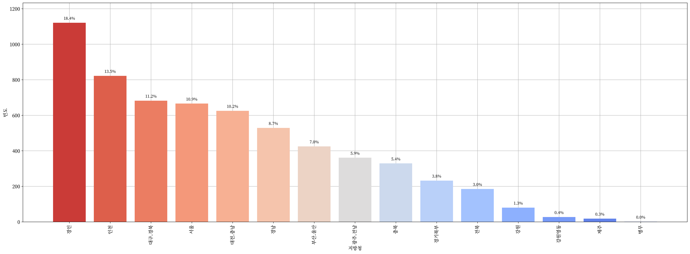

 <h1> :technologist: 산업기능요원을 위한 데이터 적재 및 시각화 :technologist: </h1> 

  
   
  

 

> [**「병역법 제2조 제17항」**](https://www.law.go.kr/%EB%B2%95%EB%A0%B9/%EB%B3%91%EC%97%AD%EB%B2%95/%EC%A0%9C2%EC%A1%B0) “산업기능요원”이란 산업을 육성하고 지원하기 위하여 제36조에 따라 산업기능요원(産業技能要員)으로 편입되어 해당 분야에 복무하는 사람을 말한다.

> [**「병역법 제3조 제1항」**](https://www.law.go.kr/%EB%B2%95%EB%A0%B9/%EB%B3%91%EC%97%AD%EB%B2%95/%EC%A0%9C3%EC%A1%B0) 대한민국 국민인 남성은 헌법과 이 법에서 정하는 바에 따라 병역의무를 성실히 수행하여야 한다.

  <h2> :computer: IT 산업기능요원 :computer: </h2>

  

    
    
    
    
     
    <a href="https://github.com/Zerohertz/awesome-sgy/blob/main/prop/IT/README.md"> :pencil: 표로 보기 :pencil: </a>
  

  <h2> :bulb: 전체 산업기능요원 :bulb: </h2>

  

    
    
    
    
    
  

